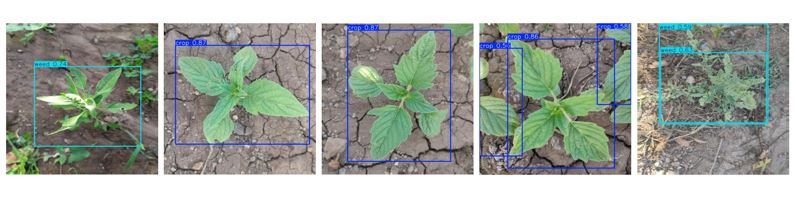

# 🌱 Crop & Weed Detection using YOLOv8

## 📌 Problem Statement
Weeds reduce crop productivity by consuming nutrients, water, and space.  
This project detects crops and weeds using computer vision to enable selective pesticide spraying.

---

## 🛠️ Tech Stack
- Python  
- YOLOv8 (Ultralytics)  
- OpenCV  
- NumPy  
- Matplotlib  
- Google Colab  

---

## 📂 Dataset
- 1300 images (512x512 resolution)  
- YOLO format annotations  
- Classes:
  - Crop 🌿  
  - Weed ❌  

---

## ⚙️ Approach
1. Data preprocessing and splitting (Train/Validation)  
2. Training YOLOv8 model  
3. Evaluating model performance  
4. Detecting crops and weeds using bounding boxes  

---

## 📊 Results
### 🔍 Detection Output


---

## ▶️ How to Run
```bash
pip install ultralytics
